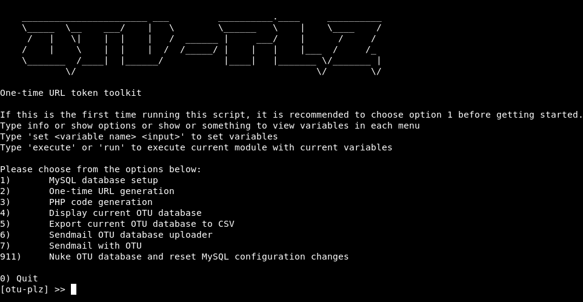

## otu-plz  

otu-plz is an open-source phishing campaign toolkit that makes setting up phishing infrastructure, sending emails with one-time use tokens, and evading blue teams a breeze. It also stores all information within a database to keep track of clicks and other data.  

otu-plz creates a MySQL database, generates a one-time use token, adds the token to the database, and generates PHP code that should be inserted into a web page on the server that is hosting the database. The overall goal of the script is to send one-time use URLs during spearphishing campaigns/red teams, so that in case an incident response team tries to replay an attack/payload chain they are served a false payload and infrastructure is not burned. This has been tested with certutil (requires two requests) and pubprn.vbs (requires one request) and works. This script has been tested on Kali and should work without additional requirements. otu-plz also can send customized emails by generating tokens for a list of emails and then feeding the tool a HTML file (message.txt for example) as the message to be sent (this requires an account to be created through an email service or SMTP server).  

--------------------

### Usage:

```Python
python3 otu-plz.py
```  

  

After selecting module, show options and set appropriate variables, then execute. For first time use, use menu 1, 2, and 3. If the database has been generated you can start by using 2 and 3. It should be noted that option 1 changes the system's MySQL database configurations so that it does not broadcast the MySQL onto the external network. If the nuke option is used it will revert settings.  

Menu commands (tab completion works!):  

	Set a variable for the current module:	set <variable> <value>  
	Show all variables for current module:	show OR options OR help  
	Execute module:				execute OR run  
	Go back to main menu:			back OR home  
	Exit script:				exit  

Clean installs of linux flavors most likely need the following:
```bash
apt install mysql-server python python-mysqldb php libapache2-mod-php php-mysql -y
a2enmod php
```  

--------------------

#### Suggested Improvements:  
* Would like to save previous options in mysql DB

@ me on twitter with other suggestions :)  

--------------------

#### Author:  
Jesse Nebling (@bashexplode)

--------------------

#### License:
This script is under the BSD 3-Clause license.
